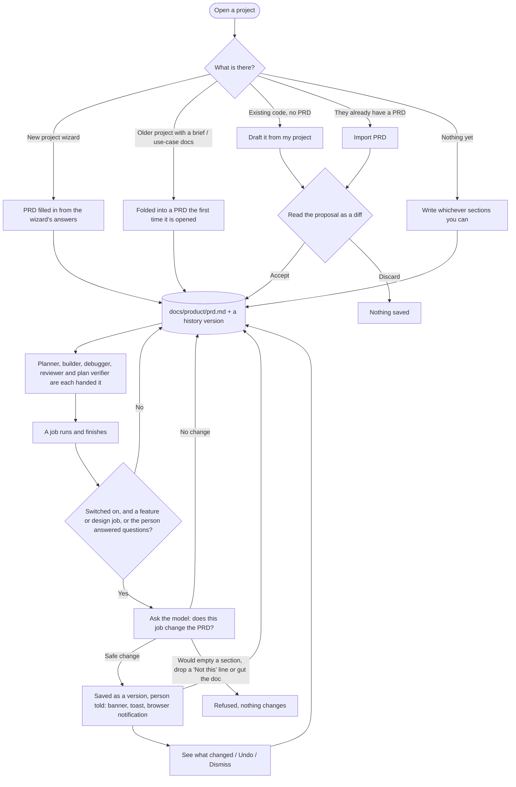

# Product requirements (the PRD)

Every project has one short document, `docs/product/prd.md`, that says what the product is. Every AI that plans, builds, reviews or checks work on the project reads it first, so it gets better answers than it can from the code alone. It is the person's document: they can write it, edit it, import it or have it drafted, and the app keeps it true as work finishes, tells them when it does, and lets them undo it.

This page describes how it works for the person using it, then what happens underneath.

## The document

Five sections, in the person's own words wherever possible. **Every section is optional**: write what you know and leave the rest.

| Section | What goes in it | Optional |
|---|---|---|
| **Pitch** | What it is, said the way you'd explain it to a friend. Also a `Built for:` line (iOS app, web app, "not decided yet"…). | Yes |
| **Who it's for** | An ideal user, or the situations it's for. "Not sure yet" is a fine answer. | Yes |
| **Core features** | The things it has to do, one per line. User-story form ("As a …, I can … so that …") is encouraged, not required. | Yes |
| **Look and feel** | A description ("feels like Google Docs"), plus designs, sketches, links and items from a connected app such as Figma. | Yes |
| **Not this** | What it should not be or include: features you don't want, competitors not to copy exactly. | Yes |

Each section starts with a line of italic guidance. Guidance and lines beginning `TBD:` don't count as content, so a section is "written" only when the person (or an accepted draft) has put something real in it.

## The flow

### 1. Getting a first version

The Product page (**Product** card on Home, then **Open**) offers these, most useful first for the situation:

- **Write it.** Click **Write** on a section and type. Every section is optional: write what you know and leave the rest. Anything written is enough for the document to start doing its job.
- **Draft it from my project.** For a project that already has code (a README, notes, a manifest or source files), the app reads a bounded summary of it: the README, `AGENTS.md`/`CLAUDE.md`, a few files in `docs/`, manifests (`package.json`, `pyproject.toml`, `Package.swift`, …), the top-level layout, source files by type and the last 30 commit subjects. A model proposes a first PRD from that. It describes what the product does today, says what it inferred and what it couldn't tell, and writes `TBD:` questions for the rest. **It never writes "Not this"**: only the person can say what the product shouldn't be, and builders and reviewers treat that section as law.
- **Import PRD.** Drag a file onto the drop zone (on a computer) or browse files. A markdown, text or Word (`.docx`) file, a PDF (needs the `pdftotext` tool, `brew install poppler`), or pasted text. It is rearranged into the five sections keeping the person's wording; what doesn't fit is summarised in a line or left out, and the proposal says which.
- **New project wizard.** The answers to the wizard's questions (name, one-sentence pitch, audience, problem, day-one features, platforms, technology preferences, how you'll know v1 works) write the first version. "Not sure: recommend for me" becomes a note telling the first plan to recommend platforms, with reasons.

Drafts and imports are always shown as a diff with **Accept and save** / **Discard**. Nothing is written until the person accepts.

**With no PRD at all** nothing breaks. Jobs run as before with no product context, the automatic update never runs (there is nothing to keep true) and never creates a document, and Home, Check-up and the New job form point at the Product page. Before the first feature or design in a project with no Pitch, New job suggests defining the product first (it can be skipped).

### 2. Editing by hand

Each section has an **Edit** button (**Write** when empty). Saving replaces only that section; headings the person added to the file elsewhere are kept. The file is ordinary markdown in the repo, so it can also be edited in any editor and committed; the Product page picks the change up. An edit made outside the app is kept and is included in the next version the app saves, but it doesn't get a version of its own, so restoring an older version would drop it unless it was committed to git. Commit outside edits.

### 3. Look and feel: designs and links

On the Look and feel section:

- **Add a design or sketch.** Images, PDFs, `.fig` and HTML files up to 25 MB. They're saved in the repo under `docs/product/designs/` and listed as bullets in the section; images also show as thumbnails. Logs are refused (they belong on a job).
- **Add a link.** A label and an `http(s)` URL, for example a Figma file.
- **Pick from a connected app.** Items from Figma (and the other connected apps) are added as a link, plus their image when the app provides one.

Only plain images are shown in place. Any other file type is served as a download, so an uploaded file can never run inside the app.

### 4. Keeping it true

When a job finishes building, the worker checks whether the job changes what the PRD says:

- **Which jobs:** feature and design jobs, and any job where the person answered the AI's questions. Quick fixes and plain bug fixes are skipped. Each job is checked once.
- **What the model sees:** the current document and a digest of the job: what it did, the builder's summary, the assumptions it made, what it was built to do, and the questions the person answered with their answers.
- **The rules it's given:** change the document only where the job clearly adds to it or contradicts it; keep the person's own words (add or adjust a line, never rewrite their wording); never remove anything under "Not this"; no implementation detail (files, libraries).
- **A safety check on the result.** An edit is refused, and nothing changes, if it empties a section that had content, removes any line from "Not this", or cuts the document below 60% of its length. A model failure or an unreadable answer is also a no-op: it never stops the job.
- **Which model:** the job's own reviewer, restricted to the job's allowed models, so a free-models-only job stays free-only.
- **Where it runs:** in an empty scratch folder, not the project. An agentic model (one with file tools) can't write the document directly and skip the history.

If the edit is applied it is saved as a version, and the person is told:

- a **banner** on Home and on the Product page ("The product requirements were updated after "Add rematch". Added the rematch feature this job built.") with **See what changed**, **Undo** and **Dismiss**;
- a **toast** the next time the page polls (not for an update that was already waiting when the page loaded: that shows as the banner only);
- a **browser notification**, if the person has turned those on.

The **switch** "Update this automatically when jobs finish" on the Product page turns all of this off (on by default). When it is off the model is never asked.

### 5. History and undo

Every change is a version: the person's edits, accepted drafts, imports and Help proposals, automatic updates, restores, and a one-time "before changes were tracked" version of a document that existed first. The History list shows when, who (You, Updated automatically after a job, Imported, AI help, Restored an earlier version…) and a one-line summary, with **See changes** (a diff against the version before) and **Restore**.

**Undo** on an automatic update restores the version before it. A restore is itself a new version, so nothing is ever lost; going back and forward is always possible. History keeps the latest 60 versions.

### 6. Who reads it

The filled-in sections are put in front of each role in a form that suits it, headed `## Product context (source of truth)`:

| Reader | How much it gets | Its rule |
|---|---|---|
| Planner | Most of each section (pitch and "who" ~1,500 characters each, features ~3,000) | Serve the people and features described, stay inside "Not this", and say in the plan's assumptions or risks if it would contradict the document. |
| Builder, debugger | Less (~600 to 1,200 per section) | Build only what the task asks, match the look and feel, stay inside "Not this", and use `clarification_needed` instead of guessing if the task can't be done without contradicting it. |
| Reviewer | Medium | Flag work that serves none of the features, builds something under "Not this", or departs from the look and feel, even if the code is correct. |
| Plan verifier | Medium | Reject or flag a plan that builds something under "Not this", serves no listed feature, or departs from the look and feel. |

Sections are trimmed one at a time, so a long feature list never squeezes out "Not this". Empty sections add nothing; a project with no written PRD adds no context at all.

### 7. Check-up

Check-up has one **Product requirements** item: *todo* with nothing in the Pitch, *todo* naming what's missing if "Who it's for" or "Core features" is empty, *ok* once those three are written (and it says if automatic updates are off). The `Built for:` line also feeds the **Platforms** item.

## What is stored where

| What | Where | Committed? |
|---|---|---|
| The document | `docs/product/prd.md` | Yes, with the project |
| Designs and sketches | `docs/product/designs/` | Yes |
| Version history | `.orchestrator/prd-history.json` (latest 60, full text of each) | No (local runtime state) |
| Auto-update switch and the latest unseen update notice | `.orchestrator/prd.json` | No |
| "This job has been checked" | `prd_checked` on the job file | No |

History is local to the machine running Orchestrator. The document itself is the thing to commit and share; to see an older version on another machine, use `git log` on the file.

## Earlier projects

A project that has the older product documents (`docs/product-brief.md`, `docs/product/use-cases.md`) gets a PRD built from them the first time the Product page, Check-up or an update looks at it: the brief becomes the Pitch, the users and use cases become "Who it's for", the version-1 list becomes "Core features" and the non-goals become "Not this". It is recorded in the history as "Built from the earlier product documents". The old files are left where they are and are no longer read. The other old documents (journey, screens, technical decisions, current plan) and the periodic product-review job were retired: a document that keeps itself true makes them redundant.

## Developer reference

- **Module:** `orchestrator/prd.py`: the section model, parsing, `context_block`, the `Prd` class (document, history, settings, notice, migration), the prompts and reply parsers (`questions_prompt`, `refine_prompt`, `import_prompt`, `draft_prompt`, `update_prompt`), `extract_text`, `project_digest`, `unsafe_update` and `run_update`. It never calls a model itself; callers pass one in.
- **Worker hook:** `update_product_requirements` in `orchestrator/scripts/worker_run.py`, run after a job's review and before its status report. Failures print a note and never fail the job.
- **Prompt wiring:** `new_job.py` (planner and verifier), `run_builder.py`, `debug_job.py`, `review_ready.py` call `prd.context_block(ROOT, audience)`.
- **API** (all under `/api/product`; writes need the UI header and a signed-in session):

| Request | Does |
|---|---|
| `GET /product` | The document, its five sections, history, settings, unseen notice and whether a draft is possible. Never creates a file. |
| `POST /product` `{section, body}` or `{text, source, summary}` | Save one section, or the whole document. `source` is `you`, `import` or `draft`. |
| `POST /product/settings` `{auto_update}` | The automatic-update switch. |
| `POST /product/dismiss` | Mark the update notice seen. |
| `GET /product/history/<id>` | One version, with a diff against the one before. |
| `POST /product/revert` `{id}` | Restore a version (recorded as a new version). |
| `POST /product/import` | A file (raw body, `?name=`) or `{text}`. Starts the work and returns `{task}` at once (202). |
| `POST /product/draft` | Draft from the project. Starts the work and returns `{task}` at once (202). |
| `GET /product/task/<id>` | How a started import or draft is getting on: `running`, `done` with the proposal and its diff (saves nothing), or `error` with why. 404 once it has expired (30 minutes). |
| `DELETE /product/task/<id>` | Stop or cancel an in-flight background task (or `POST /product/task/<id>/cancel`). |
| `POST /product/design?name=` | Upload a design (raw body, up to 25 MB). |
| `GET /product/design/<name>` | A saved design: images inline, anything else as a download. |
| `POST /product/reference` `{label, url}` or `{links}` | Add a link, or items picked from a connected app. |

  `GET /api/state` also carries `product_notice` (the latest unseen automatic update), which the page polls to announce it.
- **Slow model calls run in the background.** Import and Draft return a task id straight away and the page polls `GET /product/task/<id>` every 1.5 s, so no single request stays open (a quick tunnel closes one after about 100 s, which made a slow model look like a failure). If the model's reply isn't in the expected format it is asked once more, with the format restated, before an error is shown.
- **Answer-only model calls** (Import, Draft, job chat) go through `_model_call` in `orchestrator/web/server.py`, which runs `job_chat_run.py` in an empty scratch folder.

## Tests

`tests/test_prd.py` (the module), `tests/test_web_ui.py` (`ProductEndpointTests` and the static page checks), `tests/test_product_context_wiring.py` and `tests/test_e2e_workflow.py` (what each role is handed), and `tests/e2e/test_pipeline_offline.py` (`LivingPrdTests`, `ReadOnlyModelCallTests`: the real worker through a finished job, with a scripted model). See [build-test-commands.md](build-test-commands.md).

## Limits worth knowing

- How closely any given model follows the product context, and how good its automatic edits are, has not been measured. The safety check refuses damaging edits; it can't judge whether a good-looking edit is right. That is what the banner and Undo are for.
- A draft is built from what the project contains. A thin project (no README, few files) gives a thin draft, and a model can still misread what a project is for; the proposal states what it inferred so the person can correct it.
- The history is local runtime state, not committed.
- Drift between the document and the code is only caught when a job's own information contradicts the document. There is no separate periodic review.
